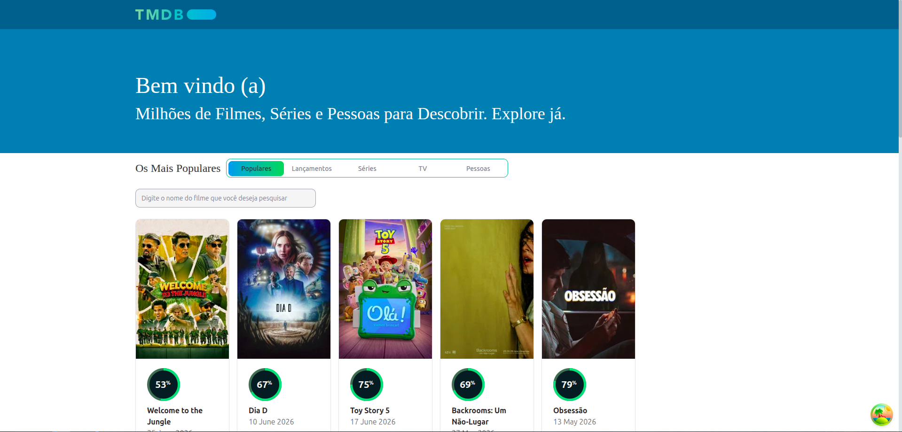
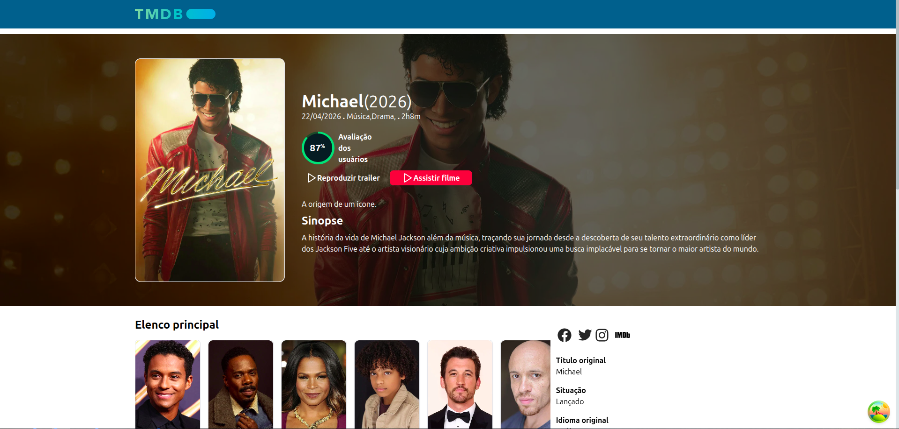
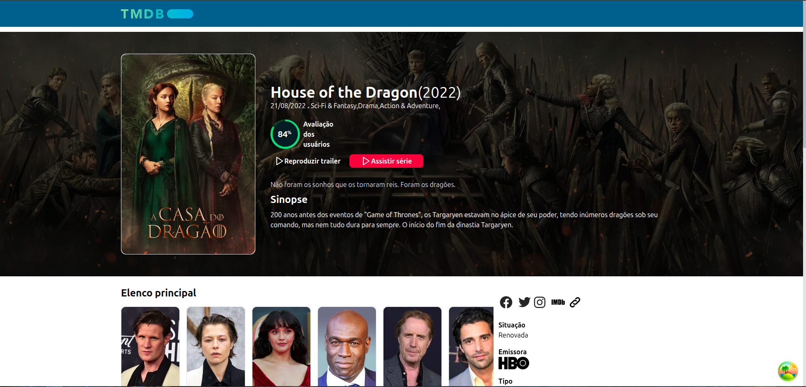
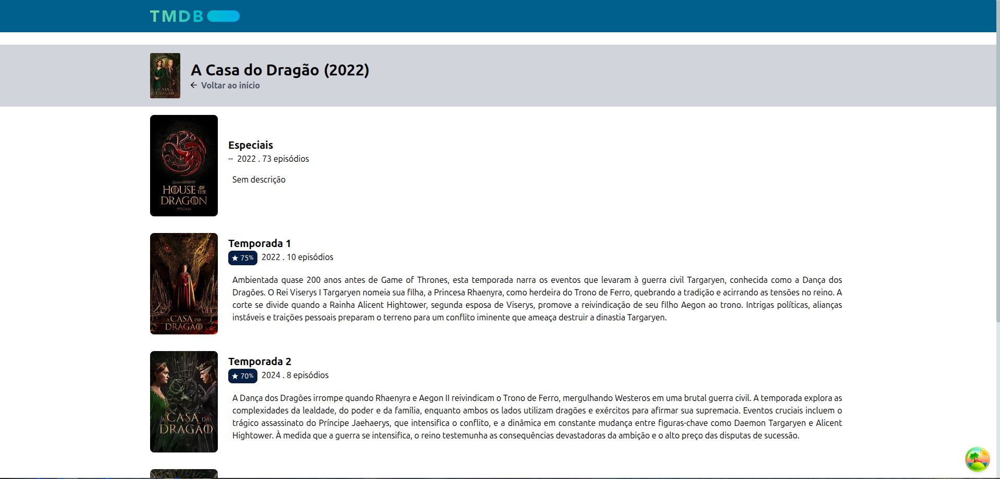
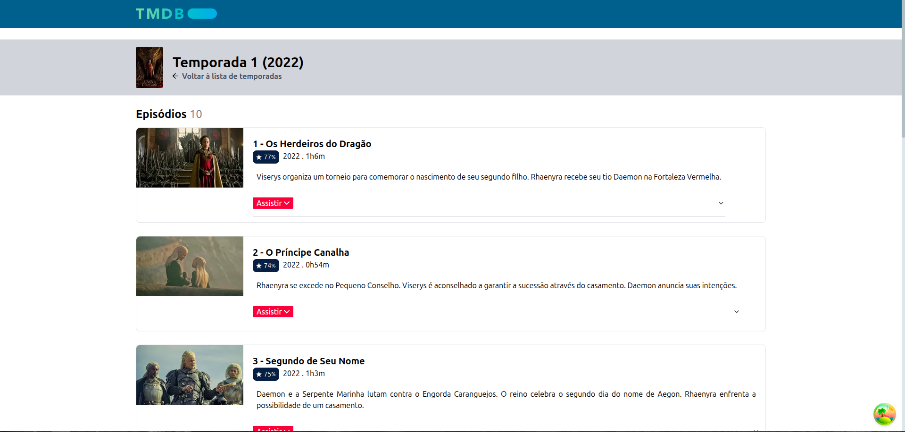
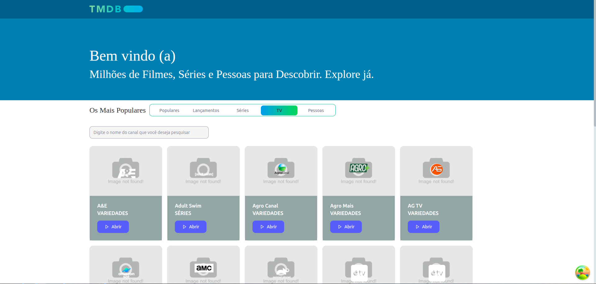

<p align="center">
  
</p>

<h1 align="center">App Movies TMDB</h1>

<p align="center">
  Aplicação web para explorar filmes, séries, atores e muito mais, utilizando a API do The Movie Database (TMDB).
  <br />
  <a href="https://developer.themoviedb.org/docs/getting-started"><strong>TMDB API Docs »</strong></a>
</p>

<p align="center">
  
  
  
  
  
</p>

---

## Índice

- [Screenshots](#screenshots)
- [Sobre o Projeto](#sobre-o-projeto)
- [Funcionalidades](#funcionalidades)
- [Tecnologias](#tecnologias)
- [Arquitetura](#arquitetura)
- [Estrutura do Projeto](#estrutura-do-projeto)
- [Fluxo de Dados](#fluxo-de-dados)
- [Começando](#começando)
  - [Pré-requisitos](#pré-requisitos)
  - [Instalação](#instalação)
  - [Variáveis de Ambiente](#variáveis-de-ambiente)
- [Scripts Disponíveis](#scripts-disponíveis)
- [Deploy](#deploy)
- [Licença](#licença)

---

## Screenshots

> OS screenshots abaixo descrevem as principais telas do projeto app-tmdb.

| Tela | Descrição |
|------|-----------|
|  | **Home / Dashboard** — Tela principal com abas para navegar entre filmes populares, lançamentos, séries, canais ao vivo e pessoas famosas. |
|  | **Detalhes do Filme** — Página completa com pôster, backdrop, trailer, elenco, avaliações, mídia, recomendações e players de streaming. |
|  | **Detalhes da Série** — Informações completas da série com temporadas, elenco, vídeos e recomendações. |
|  | **Temporadas** — Lista todas as temporadas disponíveis de uma série. |
|  | **Episódios** — Exibe os episódios de uma temporada com player de vídeo embutido. |
|  | **Lista de canais de TV** — Esta tela tem uma lista paginada de canais de TV, além disso é possível pesquisar por um nome especifico de um canal de TV. |

---

## Sobre o Projeto

O **App Movies TMDB** é uma aplicação web React desenvolvida em TypeScript que consome a [API do TMDB](https://developer.themoviedb.org/docs/getting-started) para oferecer uma experiência completa de catálogo de entretenimento. O projeto é focado no público brasileiro, com UI totalmente em português (pt-BR) e integração com players de streaming embedados.

---

## Funcionalidades

- **Dashboard com Abas** — Navegue por Filmes Populares, Lançamentos, Séries, TV ao Vivo e Pessoas em uma única interface.
- **Detalhes Completos** — Páginas ricas com backdrop, pôster, nota circular, trailer no YouTube, elenco, avaliações e mídia.
- **Players de Streaming** — 5 opções de players embedados para assistir filmes e episódios diretamente no navegador.
- **Temporadas e Episódios** — Explore temporadas de séries e assista episódios com players integrados.
- **Perfil de Atores** — Biografia, filmografia, dados pessoais e links para redes sociais.
- **Busca com Debounce** — Pesquisa por filmes e séries com input com debounce de 500ms.
- **Scroll Infinito** — Navegação por palavras-chave com carregamento contínuo via IntersectionObserver.
- **Paginação** — Navegação entre páginas em todas as listagens.
- **Design Responsivo** — Layout adaptável para mobile, tablet e desktop.
- **Tema Escuro** — Interface em dark mode com paleta de cores personalizada.

---

## Tecnologias

| Categoria | Tecnologia | Versão |
|-----------|-----------|--------|
| **Framework** | [React](https://react.dev/) | ^18.2.0 |
| **Linguagem** | [TypeScript](https://www.typescriptlang.org/) | ^5.0.2 |
| **Build Tool** | [Vite](https://vitejs.dev/) | ^7.1.10 |
| **Roteamento** | [React Router DOM](https://reactrouter.com/) | ^7.13.1 |
| **Data Fetching** | [TanStack React Query](https://tanstack.com/query) | ^5.40.0 |
| **HTTP Client** | [Axios](https://axios-http.com/) | ^1.16.1 |
| **Estilização** | [Tailwind CSS](https://tailwindcss.com/) | ^3.4.3 |
| **Componentes** | [Shadcn/ui](https://ui.shadcn.com/) (Radix Primitives) | — |
| **Ícones** | [Lucide React](https://lucide.dev/) | ^0.379.0 |
| **Datas** | [date-fns](https://date-fns.org/) + [moment](https://momentjs.com/) | ^3.6.0 / ^2.30.1 |
| **Estado** | TanStack React Query (server state) + useState (local) | — |
| **Hospedagem** | [Vercel](https://vercel.com/) | — |

---

## Arquitetura

A aplicação segue uma arquitetura **monolítica SPA (Single Page Application)** com separação clara de responsabilidades:

### Camadas

```
┌────────────────────────────────────────────────┐
│                   UI Layer                      │
│   Components (pages, layouts, primitives)      │
├────────────────────────────────────────────────┤
│              Data Fetching Layer                │
│   React Query Hooks (queries.ts)               │
├────────────────────────────────────────────────┤
│               Service Layer                     │
│   API Functions (api.ts via Axios)             │
├────────────────────────────────────────────────┤
│            External APIs                        │
│   TMDB API (api.themoviedb.org/3)              │
│   + reidosembeds.com (canais TV)               │
└────────────────────────────────────────────────┘
```

### Decisões Técnicas

- **React Query** para todo estado de servidor — cache automático, deduplicação de requisições, refetch e paginação otimizada com `placeholderData: keepPreviousData`.
- **Componentização granular** — cada elemento de UI (cards, badges, reviews) é um componente isolado e reutilizável.
- **API Layer desacoplada** — funções puras em `api.ts` transformam os dados da TMDB nos tipos TypeScript da aplicação, isolando a lógica de rede dos componentes.
- **Shadcn/ui** — componentes acessíveis e customizáveis via Tailwind, sem dependência pesada de design system.
- **Vite** — build extremamente rápido com HMR nativo e tree-shaking eficiente.

---

## Estrutura do Projeto

```
app-movies-tmdb/
├── public/                        # Assets estáticos (favicon)
├── src/
│   ├── assets/                    # SVGs, PNGs, imagens estáticas
│   ├── components/
│   │   ├── ui/                    # Shadcn/ui primitives (button, card, dialog, etc.)
│   │   ├── Home.tsx               # Dashboard principal
│   │   ├── MoviesDetails.tsx      # Detalhes do filme
│   │   ├── SeriesDetails.tsx      # Detalhes da série
│   │   ├── SeriesSeasonsDetails.tsx       # Lista de temporadas
│   │   ├── SeriesSeasonsEpisodeDetails.tsx # Episódios por temporada
│   │   ├── PersonDetails.tsx      # Detalhes da pessoa/ator
│   │   ├── AllMoviesKeywords.tsx  # Filmes por palavra-chave
│   │   ├── Navbar.tsx             # Barra de navegação
│   │   ├── Footer.tsx             # Rodapé
│   │   ├── Banner.tsx             # Hero banner
│   │   ├── Card.tsx               # Card de filme/série
│   │   ├── CardImage.tsx          # Imagem do pôster
│   │   ├── CardPerson.tsx         # Card de pessoa
│   │   ├── CardPersonMovieDetail.tsx  # Card de membro do elenco
│   │   ├── CardMoviePerson.tsx    # Card de crédito no perfil da pessoa
│   │   ├── CardReview.tsx         # Card de avaliação
│   │   ├── CardKeywordMovies.tsx  # Item de filme por keyword
│   │   ├── CardTv.tsx             # Card de canal de TV
│   │   ├── CardSeasonsDetails.tsx # Card de temporada
│   │   ├── CardSeasonsEpisodeDetails.tsx # Card de episódio
│   │   ├── MoviesRecommended.tsx  # Miniatura de recomendação
│   │   ├── PaginationComponent.tsx # Controle de paginação
│   │   ├── SearchInput.tsx        # Input de busca com debounce
│   │   └── VoteAveregeItem.tsx    # Badge circular de nota
│   ├── lib/
│   │   └── utils.ts               # Utilitários (cn(), formatação de data/moeda)
│   ├── router/
│   │   └── router.tsx             # Definição de rotas (React Router)
│   ├── types/                     # Interfaces TypeScript (24 arquivos)
│   ├── utils/
│   │   ├── api.ts                 # Funções de chamada à API (Axios)
│   │   ├── queries.ts             # Custom hooks React Query
│   │   ├── providers.tsx          # Provider do React Query
│   │   └── useDebounce.ts         # Hook de debounce
│   ├── App.tsx                    # Componente raiz
│   ├── main.tsx                   # Entry point
│   ├── index.css                  # Estilos globais + variáveis CSS
│   └── vote_average.css           # Barra circular de votação (CSS puro)
├── .env.example                   # Template de variáveis de ambiente
├── components.json                # Configuração Shadcn/ui
├── index.html                     # HTML de entrada do Vite
├── package.json                   # Dependências e scripts
├── tailwind.config.js             # Configuração do Tailwind
├── tsconfig.json                  # Configuração do TypeScript
├── vercel.json                    # Configuração de deploy Vercel
└── vite.config.ts                 # Configuração do Vite
```

---

## Fluxo de Dados

```
Usuário
  │
  ▼
Componente React
  │
  ▼
Custom Hook (queries.ts) ── useQuery(queryKey, apiFunction)
  │
  ▼
TanStack React Query ── cache, dedup, keepPreviousData
  │
  ▼
API Function (api.ts) ── axios.get() + transformResponse
  │
  ▼
TMDB API ── api.themoviedb.org/3 (pt-BR)
         └── reidosembeds.com/api/channels
  │
  ▼
Dados Tipados (types/) ── retornam ao componente
```

---

## Começando

### Pré-requisitos

- Node.js >= 18
- npm >= 9
- Conta gratuita no [TMDB](https://www.themoviedb.org/) para obter a chave da API

### Instalação

```bash
# Clone o repositório
git clone https://github.com/seu-usuario/app-movies-tmdb.git
cd app-movies-tmdb

# Instale as dependências
npm install

# Configure as variáveis de ambiente (veja abaixo)
cp .env.example .env

# Inicie o servidor de desenvolvimento
npm run dev
```

### Variáveis de Ambiente

```env
VITE_API_KEY=sua_chave_da_api_tmdb
VITE_API_TOKEN=seu_token_de_acesso_tmdb
```

> Obtenha sua chave e token em [https://www.themoviedb.org/settings/api](https://www.themoviedb.org/settings/api).

---

## Scripts Disponíveis

| Script | Comando | Descrição |
|--------|---------|-----------|
| `dev` | `vite` | Inicia servidor de desenvolvimento com HMR |
| `build` | `tsc && vite build` | Compila TypeScript e gera build de produção |
| `preview` | `vite preview` | Pré-visualiza o build de produção localmente |
| `lint` | `eslint . --ext ts,tsx --report-unused-disable-directives --max-warnings 0` | Executa verificação de lint |

---

## Deploy

O projeto está configurado para deploy na **Vercel**:

1. Conecte o repositório à [Vercel](https://vercel.com/)
2. Configure as variáveis de ambiente (`VITE_API_KEY`, `VITE_API_TOKEN`)
3. Faça deploy automático a cada push na branch principal

O arquivo `vercel.json` já inclui as regras de SPA rewrites necessárias para o React Router funcionar corretamente.

---

## Licença

Distribuído sob a licença MIT. Veja `LICENSE` para mais informações.

---

<p align="center">
  
  <br />
  <sub>Desenvolvido com dados da <a href="https://www.themoviedb.org/">TMDB</a></sub>
</p>
